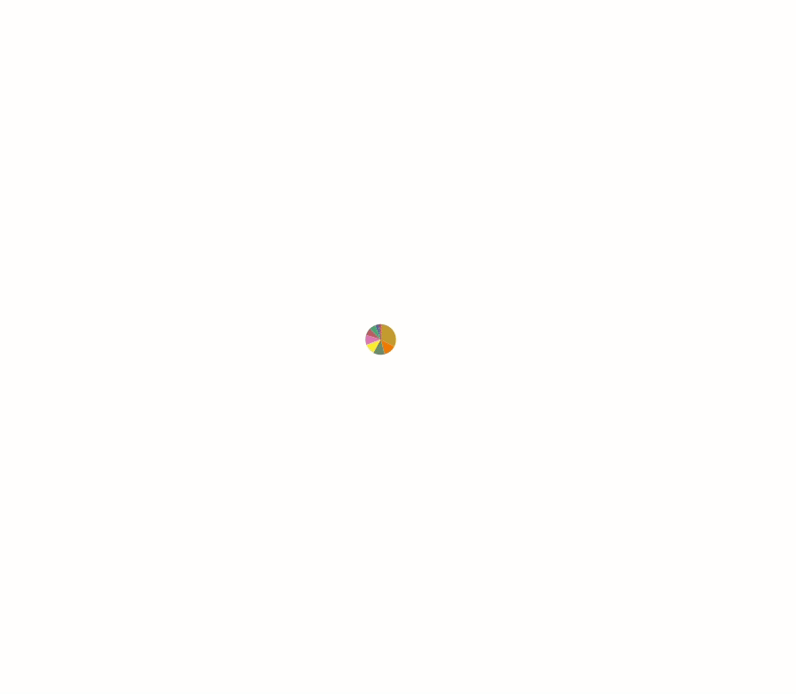

# too-many-cells-interactive

## About The Project

too-many-cells-interactive is an interactive visualization tool allowing users to explore cell cluster trees generated by [too-many-cells](https://github.com/GregorySchwartz/too-many-cells). 

### Built With

* [D3.js](https://d3js.org/)
* [React.js](https://reactjs.org/)
* [Redux.js](https://redux.js.org/)
* [Typescript](https://www.typescriptlang.org/)
* [Styled-Components](https://styled-components.com/)
* [Node.js](https://nodejs.org/en/)
* [PostgreSQL](https://www.postgresql.org/)
* [Docker](https://www.docker.com/)

## Running the application

To run the application, first make sure that you have [Docker](https://www.docker.com/) and [Docker-Compose](https://docs.docker.com/compose/install/) on your system. Before running the software, use [too-many-cells](https://github.com/GregorySchwartz/too-many-cells) to generate (among others) a `cluster_tree.json` file. The application needs access to this files as well as a file called `labels.csv` as described in the [too-many-cells documentation](https://gregoryschwartz.github.io/too-many-cells/#:~:text=labels.csv) in order to display results. Optionally, you may also include the original matrix files, which will be used to populate a database of features that can overlay your cluster tree visualization. Depending on the size of these files, it may take a while for the database to populate. The current benchmark is about 100,000 entries per second.

The simplest way to get your `cluster_tree.json` and `labels.csv` onto the app server and, optionally, upload your matrix files to the database, is to use [the import script](./node/scripts/importMatrix.ts) called `start-and-load.sh`. This script takes three required arguments: the path to the `labels.csv` file, the path to the `cluster_tree.json` file and the port on which the app will listen on your localhost. You may also include the directory path where your matrix files are stored, in which case they will be imported into the database before the app runs. 

Example: `./start-and-load.sh --matrix-dir /data/my-matrices --tree-path /data/my-results/cluster_tree.json --label-path /data/my-results/labels.csv --port 1234` 

When you are finished with the application, the postgres container will need to be stopped manually by running `docker-compose stop postgres` from the project ruoot.

**WARNING:** your matrix files will be mounted into the container and imported into a database stored in a Docker volume on your host machine. Depending on the size of your files, this may result in substantial disk usage. To free up space, consider regularly purging unneeded volumes, containers, and/or images using the [docker system prune](https://docs.docker.com/engine/reference/commandline/system_prune/) command.

Once the container has been built and the matrices imported, you can restart the program without rebuilding and reloading by omitting the matrix file path `./start-and-load.sh --tree-path /data/my-results/cluster_tree.json --label-path /data/my-results/labels.csv --port 1234` 

Note that the node image must be rebuilt locally any time there is a code change. This is handled by the `start-and-load.sh` script. 

## Generating images from the command line

It is now possible to generate svg images outside of the browser via the command line. If a template image has already been generated by the browser program, you can click on the "Export Image Configuration" button in order to download a JSON representation of its configuration, which includes size, scale, feature, and other attributes, which can then be passed to the command-line program along with the other required parameters (i.e., paths to `cluster_tree.json` and `labels.csv`). If you wish to include feature values in your plot, you will need to ensure that the postgres database has been provisioned with the appropriate data ahead of time. For scripting batch outputs, the configuration JSON may be passed as stdin to the program, enabling modifications via a library like [jq](https://stedolan.github.io/jq/manual/). The [generate-svg.sh](generate-svg.sh) script provides a convenience wrapper around the fairly complex `docker-compose` command required to run the script and [sample-export-loop.sh](sample-export-loop.sh) demonstrates how multiple images might be generated by a single configuration file, in this case by substituting the features and overriding the out path to prevent overwrites. As with similar commands, this program will mount the designated input files and output directory into the container for processing.  

## Building the application for development

To build the application for development, you will need to provision the Docker containers, compile the Typescript, and mount your `cluster_tree.json` and `labels.csv` files into the node server's `static/files` directory. To do so, you may simply copy them into your local `<project-root>/node/static/files` directory, since the the development docker-compose file mounts the host's entire `node` directory into the container.  
  - the Docker configuration for development can be found in [docker-compose.yaml](./docker-compose.yaml). Unlike the 'production' configuration, the development setup splits the javascript code into front-end (React) and back-end (Node) containers. By default, the React application will listen on port 1212. You can change this value by creating an `.env` file and entering your own value for `REACT_PORT`. There is a sample `.env` file called `.env.sample` that can serve as a basis.
  - You need to perform the provisioning process just once for a given dataset. Once the features are in the database and files moved into the static files directory, you only need to run `docker-compose up` to bring up the application. If you would like to import a new set of features, the easiest way to do so is to rerun the `start-and-load.sh` script, which will drop your previous data from the Postgres database and import new data. Your dev application will use this same data when you bring it up with `docker-compose up`.
